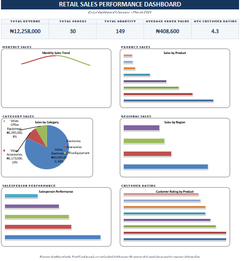

README – RETAIL SALES PERFORMANCE DASHBOARD

PROJECT OVERVIEW
This project is an Excel-based Retail Sales Performance Dashboard designed to analyze and visualize retail sales data. The dashboard converts raw transaction records into meaningful business insights using KPI cards and Excel charts.

The entire project was developed in Microsoft Excel. It does not require Power BI, macros, or external data connections.

DATASET OVERVIEW
The dataset contains 30 retail sales transactions covering January to March 2026.

## Dashboard Preview

DATASET COLUMNS
1. Order_ID – Unique identification number for each order.
2. Date – Date of the transaction.
3. Product – Product sold.
4. Category – Product category.
5. Region – Region where the sale occurred.
6. Salesperson – Salesperson responsible for the sale.
7. Quantity – Number of units sold.
8. Unit_Price – Selling price per unit.
9. Sales_Amount – Total revenue generated from the transaction.
10. Customer_Rating – Customer rating for the transaction.

KEY PERFORMANCE INDICATORS
• Total Revenue: ₦12,258,000
• Total Orders: 30
• Total Quantity Sold: 149
• Average Order Value: ₦408,600
• Average Customer Rating: 4.3/5

KPI CALCULATIONS
Total Revenue = Sum of Sales Amount

Total Orders = Number of sales transactions

Total Quantity = Sum of Quantity

Average Order Value = Total Revenue ÷ Total Orders

Average Customer Rating = Average of Customer Rating

DASHBOARD VISUALIZATIONS
The dashboard contains six major visualizations:

1. Monthly Sales Trend
Shows the movement of sales revenue from January to March 2026.

2. Sales by Product
Compares the revenue generated by each product.

3. Sales by Category
Shows the contribution of each product category to total revenue.

4. Sales by Region
Compares sales revenue across the different regions.

5. Salesperson Performance
Shows the revenue generated by each salesperson.

6. Customer Rating by Product
Compares the average customer rating for each product.

WORKBOOK STRUCTURE

1. Dashboard
The main presentation sheet containing the KPI cards and six charts.

2. Sales Data
Contains the original retail transaction records in an Excel table. This sheet can be used to review, filter, and analyze individual transactions.

3. Chart Data
Contains the summarized information used as the source for the dashboard charts.

HOW TO USE THE WORKBOOK

1. Open the Excel workbook in Microsoft Excel.
2. Start from the Dashboard worksheet.
3. Review the KPI cards at the top.
4. Examine the six charts for sales trends and performance.
5. Go to the Sales Data worksheet to inspect individual transactions.
6. Use the Chart Data worksheet to review the summarized data supporting the visualizations.

DATA LIMITATION
The dataset contains sales revenue information but does not contain product cost, COGS, or operating expenses.

Therefore, the following metrics cannot be reliably calculated from the available data:

• Gross Profit
• Net Profit
• Gross Profit Margin
• Net Profit Margin

The dashboard therefore focuses on sales performance, revenue, quantity, customer ratings, products, regions, and salesperson performance.

KEY BUSINESS INSIGHTS
• Total revenue generated was ₦12.258 million.
• The business recorded 30 sales transactions.
• A total of 149 units were sold.
• Average Order Value was ₦408,600.
• Average customer rating was 4.3 out of 5.
• February 2026 recorded the highest monthly sales revenue.
• Electronics generated the largest share of revenue.
• Phones were among the highest-revenue products.
• Regional and salesperson analysis provides useful comparisons of sales performance.

TOOLS AND TECHNIQUES
Primary Tool: Microsoft Excel

Techniques Used:
• Data cleaning
• Data aggregation
• Excel Tables
• Excel formulas
• KPI calculations
• Excel charts
• Data visualization
• Dashboard design
• Business insight generation

PROJECT OBJECTIVE
The objective of this project is to demonstrate how raw retail transaction data can be transformed into a professional Excel dashboard that provides a clear view of sales performance and supports data-driven business analysis.

PROJECT DETAILS
Project Type: Retail Sales Data Analysis
Platform: Microsoft Excel
Dataset Size: 30 transactions
Analysis Period: January–March 2026
Currency: Nigerian Naira (₦)
